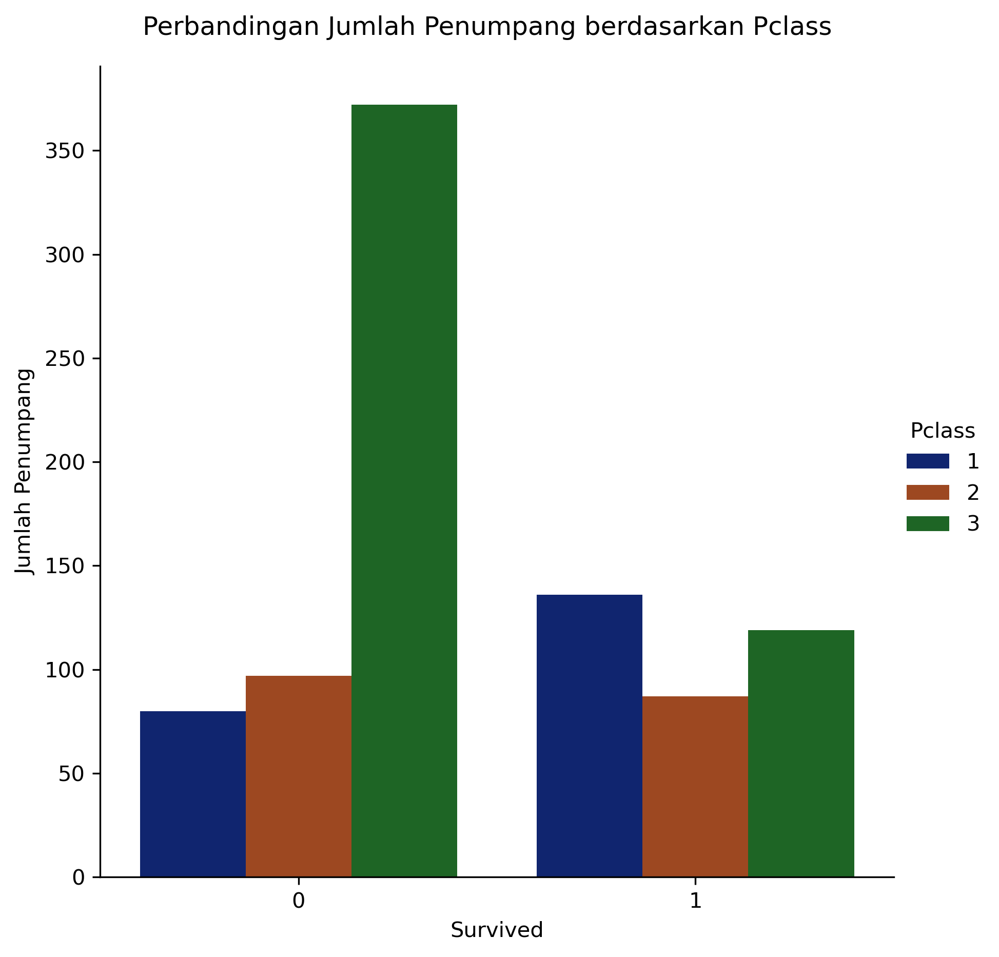

# 🚢 Titanic Survival Prediction
**A Machine Learning Project to Predict Passenger Survival on the RMS Titanic**

<p align="center">
  
</p>

---

## 🔍 Overview

Tragedi **RMS Titanic (1912)** menyisakan pertanyaan besar:

> *Faktor apa yang menentukan seseorang selamat dalam tragedi Titanic?*

Project ini menganalisis dataset Titanic secara end-to-end:

- 🧹 Data cleaning & missing values handling  
- 🔎 Exploratory Data Analysis (EDA)  
- ✨ Feature engineering (Title extraction, encoding, etc.)  
- 🤖 Model training & evaluation  
- 🔁 Cross-validation (K-Fold)  
- 🏆 Menemukan model terbaik

---

## 📁 Project Structure

Titanic-Survival-Prediction/

│

├─ notebooks/

│ └─ Titanic.ipynb

│

├─ images/

│ ├─ eda_sex_distribution.png

│ ├─ eda_pclass_survival.png

│ └─ gradient_boost_model_score.png

│

├─ report/ (optional)

│ └─ titanic_insight_summary.pdf

│

├─ README.md

└─ requirements.txt


yaml
Salin kode

---

## 📊 Key Insights (EDA)

| Feature | Pengaruh Terhadap Survival |
|--------|----------------------------|
| 🎀 **Sex** | Penumpang wanita jauh lebih besar peluang selamat |
| 💰 **Fare** | Tarif mahal → peluang selamat lebih tinggi |
| 🎫 **Pclass** | Kelas 1 memiliki survival rate tertinggi |
| 👪 **Family Size** | Keluarga kecil memiliki peluang selamat lebih baik |

📌 *Title (Mr, Mrs, Miss, dll.) juga menjadi salah satu fitur paling penting dalam prediksi.*

---

## 🤖 Model Performance

| Model | Rata-rata Akurasi |
|-------|------------------|
| GaussianNB | 0.79 |
| Decision Tree | 0.77 |
| Random Forest | 0.81 |
| **Gradient Boosting** 🔥 | **0.82** 🏆 *(Best Model)* |

📌 *Gradient Boosting memberikan generalisasi terbaik dan menangkap hubungan non-linear antar fitur.*

---

## ▶ How to Run

```bash
git clone https://github.com/AkhmadIkmalZulfa/Titanic-Survival-Prediction.git
cd Titanic-Survival-Prediction
pip install -r requirements.txt
jupyter notebook notebooks/Titanic.ipynb
🧠 Conclusion
Women & children had a significantly higher chance of survival

Higher ticket fare and first-class passengers were prioritized

Extracted Title feature dramatically improved model accuracy

Gradient Boosting achieved the best performance (0.82)

🧑‍💻 Author
Akhmad Ikmal Zulfa
📍 Data Analyst & Machine Learning Enthusiast
🔗 LinkedIn | 📧 akhmadikmalzulfa@gmail.com
